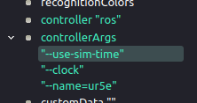
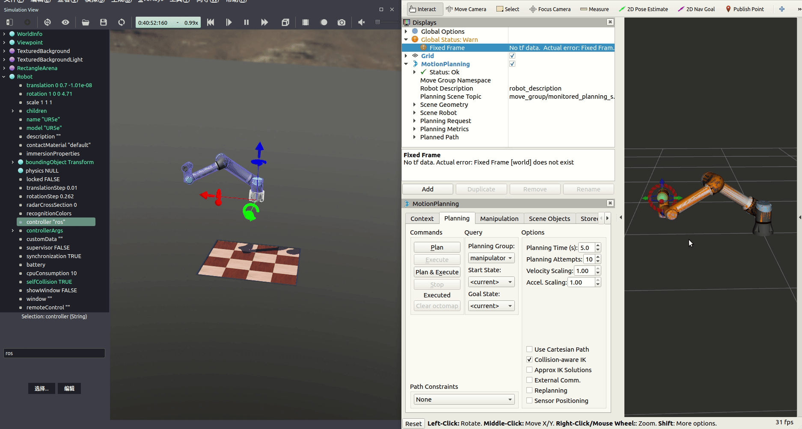

# 安装
要使用该软件包，您需要将其复制到catkin工作区中，安装依赖项并进行编译：
``` shell
$ cd catkin_ws/src
$ cp -r $WEBOTS_HOME/projects/robots/universal_robots/resources/ros_package/ur_e_webots .
$ cd ..
$ rosdep update
$ rosdep install --from-paths src --ignore-src --rosdistro $ROS_DISTRO
$ catkin_make
$ source devel/setup.bash
```
仅仅安装完这个还不够，还需要安装universal_robots功能包，他提供了universal_robots 机械臂的URDF文件、RVIZ和moveit！的启动整合文件。在Kinetic之前，您可以使用包管理器（apt install ros-$ROS_DISTRO-universal-robot）进行安装，但要从Melodic进行安装，则需要从[源代码](https://github.com/ros-industrial/universal_robot/tree/melodic-devel)进行编译。
# 使用
- 打开webots仿真环境
``` shell
$ roslaunch volcano_moveit ur_webots.launch 
```
将控制器改为`ROS`

- 发布/joint_states
``` c++
$ rosrun volcano_moveit robot_state_publisher
```
- 发布action
``` c++
$ rosrun volcano_moveit trajectory_follower
```
- 使用universal_robot功能包下的launch文件启动Moveit！
``` c++
$ roslaunch ur5_e_moveit_config ur5_e_moveit_planning_execution.launch 
``` 
- 使用universal_robot功能包下的launch文件启动Rviz
``` c++
$ roslaunch ur5_e_moveit_config moveit_rviz.launch config:=true
```
效果如下：

